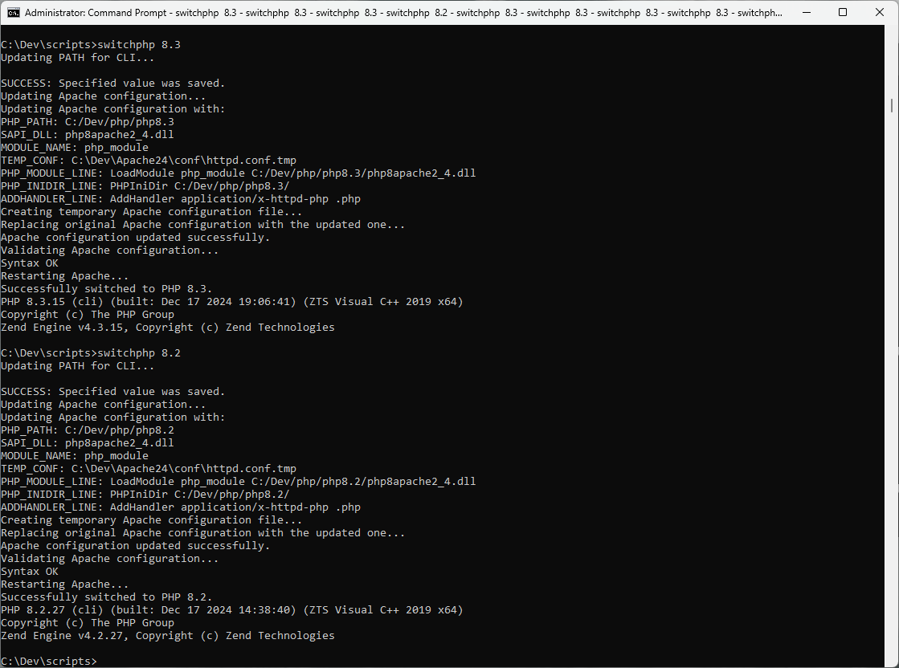

# PHP Version Switcher for Apache on Windows

This script allows you to switch between different versions of PHP for your Apache server on a Windows environment. It updates the system PATH and modifies the Apache configuration to use the specified PHP version.



## Supported PHP Versions

- PHP 7.4
- PHP 8.0
- PHP 8.1
- PHP 8.2
- PHP 8.3

## Prerequisites

- Apache installed and configured on your system.
- PHP versions installed in the specified directory.

## Installation and Setup

1. **PHP Installation**:
   - Download the desired PHP versions from the [official PHP website](https://www.php.net/downloads).
   - Extract each PHP version into its own directory under a common base directory. For example:
     ```
     C:/Dev/php/
     ├── php7.4/
     ├── php8.0/
     ├── php8.1/
     ├── php8.2/
     └── php8.3/
     ```
   - Ensure that each PHP version folder contains the appropriate `php.ini` files and the SAPI DLL files (`php7apache2_4.dll` for PHP 7 and `php8apache2_4.dll` for PHP 8).

2. **Clone the Repository** or download the script file.

3. **Modify the Script**:
   - Open the `switch-php.bat` file in a text editor.
   - Update the following paths according to your installation:

    ```batch
    :: Define base paths for PHP installations and Apache configuration
    set "PHP_BASE_PATH=C:/Dev/php"
    set "APACHE_CONF=C:\Dev\Apache24\conf\httpd.conf"
    set "APACHE_BIN=C:\Dev\Apache24\bin\httpd.exe"
    ```

4. **Ensure Apache is Running as a Service**:
   - Open Command Prompt as Administrator.
   - Run the following commands to stop and start Apache as a service:

    ```batch
    net stop Apache2.4
    net start Apache2.4
    ```

5. **Admin Privileges and Permissions**:
   - Ensure you run the script as an Administrator. Right-click on Command Prompt and select "Run as administrator."
   - The script modifies system PATH and Apache configuration files, which require administrative privileges.

6. **Add `switch-php.bat` to System PATH**:
   - To easily run the script from any command prompt, you can add the directory containing `switch-php.bat` to your system PATH.
   - Open Command Prompt as Administrator and run the following command, replacing `C:\Path\To\Script` with the actual path to your script:

    ```batch
    setx PATH "%PATH%;C:\Path\To\Script" /M
    ```

## Usage

1. **Run the Script**:
   - Open Command Prompt as Administrator.
   - Navigate to the directory where the script is located (or ensure it is in your PATH).
   - Run the script with the desired PHP version as an argument. For example, to switch to PHP 8.3, use:

    ```batch
    switch-php.bat 8.3
    ```

2. **Script Output**:
   - The script will update the system PATH, modify the Apache configuration, validate the configuration, and restart Apache.
   - If successful, you will see a message indicating the PHP version has been switched, and the current PHP version will be displayed.

## Troubleshooting

- Ensure you run the script as an Administrator.
- Verify the paths to your PHP installations and Apache configuration.
- Check the Apache error logs if the service fails to start.

## License

This project is licensed under the MIT License - see the [LICENSE](LICENSE) file for details.